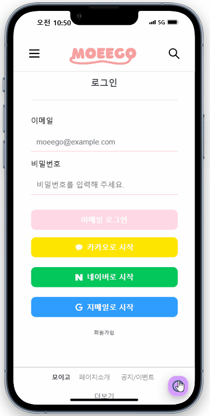
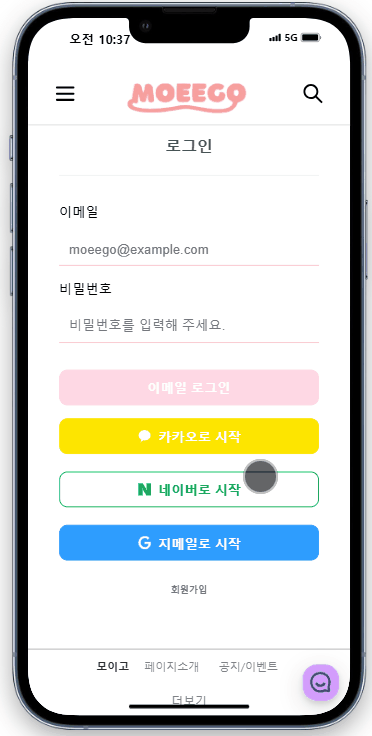

## 메인페이지 시연 영상
기본 페이지 및 다크모드 시연 

## 회원기능 시연 영상
회원의 기본 기능(가입 및 로그인, 마이페이지) 시연 

## 달인기능 시연 영상1
달인 회원가입 및 전환, 달인의 서비스 등록 시연 

## 달인기능 시연 영상2
등록된 달인 및 서비스 찾기 및 서비스 별 예약 및 리뷰 시연 

## 커뮤니티 페이지 시연 영상
커뮤니티 페이지의 기본 기능(글 작성, 수정, 삭제, 댓글 작성, 수정 삭제) 시연 

## 관리자 페이지 시연 영상
관리자 페이지의 기능(회원 관리, 공지 및 이벤트 관리) 시연 

## 네이버 및 카카오 SNS 로그인
SNS 로그인 서비스 시연 
&emsp;&emsp;&emsp;&emsp;&emsp;
